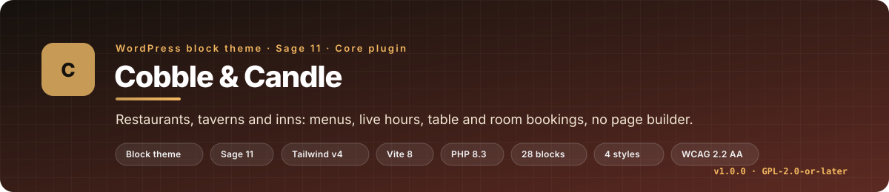

<p align="center">
  
</p>

<p align="center">
  <a href="https://github.com/matthummel-pa/wp-cobbleandcandle/releases/tag/theme-latest"></a>
  
  
  
  
  
  <a href="https://github.com/matthummel-pa/wp-cobbleandcandle/actions/workflows/wp-review.yml"></a>
  <a href="https://github.com/matthummel-pa/wp-cobbleandcandle/actions/workflows/deploy-theme.yml"></a>
  <a href="LICENSE"></a>
</p>

# Cobble & Candle

**A WordPress block theme for restaurants, taverns and inns, built from scratch on Sage 11.** Menus with diet filters, live "open now" hours per location, native table and room bookings with two-way iCal sync, events, galleries and a full owner dashboard, all editable in the Site Editor. No page builder, no ACF, no jQuery.

Cobble & Candle is the third product theme in my Sage series, after [Acreline](https://github.com/matthummel-pa/wp-acreline) and [Walkridge](https://github.com/matthummel-pa/wp-walkridge), and the first one built as a **block theme** with a companion content plugin. This README is written for two readers: a restaurant owner deciding whether to buy, and a developer or hiring manager who wants to see how the theme was designed, built and shipped.

| Home (Lampwright) | Menu with diet filters |
| --- | --- |
| [](docs/marketplace/screenshots/01-home.jpg) | [](docs/marketplace/screenshots/15-menu-diet-filter.jpg) |
| **Room with live calendar** | **Owner dashboard: bookings** |
| [](docs/marketplace/screenshots/06-room-booking.jpg) | [](docs/marketplace/screenshots/a-bookings.jpg) |

<p align="center"><a href="docs/marketplace/styles.jpg"></a></p>

> All 59 screenshots (desktop, mobile, admin and every style) are in [`docs/marketplace/screenshots/`](docs/marketplace/screenshots/).

## At a glance

| | |
| --- | --- |
| **What it is** | A GPL block theme plus the **Cobble & Candle Core** plugin, sold as one zip and installed in two clicks |
| **Who it is for** | Independent restaurants, taverns and B&Bs with one to several locations |
| **Stack** | WordPress 6.6+ block theme · Sage 11 · Acorn 6 · Blade · Tailwind CSS v4 · Vite 8 · Alpine.js · PHP 8.3 |
| **Size** | 28 blocks · 13 templates · 8 patterns · 4 style variations · 69 Blade views · 24 plugin files (~7.2k lines) · 10 theme modules (~1.1k lines) |
| **Content model** | 7 post types in the plugin (location, menu, section, dish, event, room, booking) plus messages; survives a theme switch |
| **Quality gates** | `wp-review` changed-lines review · Laravel Pint · PHPStan level 5 · Lighthouse SEO and accessibility 100 · zero axe-core violations in four styles |
| **Ship** | Merge to `main` → GitHub Actions builds and publishes `cobbleandcandle.zip` on the `theme-latest` release |
| **Built** | 2–3 October 2026: 37 pull requests, every one reviewed with `wp-review` and a security pass before merge |

## Contents

- [Why I built it](#why-i-built-it)
- [Features](#features)
- [Architecture](#architecture)
- [How it was built](#how-it-was-built)
- [Engineering practices](#engineering-practices)
- [What I learned](#what-i-learned)
- [Local development](#local-development)
- [Deploy](#deploy)
- [Repo map](#repo-map)
- [Related repos](#related-repos)
- [Credits and license](#credits-and-license)

## Why I built it

Marketplace restaurant themes almost always ship a page builder, static opening hours, a third-party booking widget and no structured data. Owners end up editing in Elementor, pasting hours into a text block, and paying a monthly fee for a reservation iframe. Cobble & Candle takes the opposite position:

- **Content outlives the theme.** Locations, menus, events, rooms and bookings live in a plugin, so a redesign never destroys a menu.
- **Hours are data.** Each location has weekly windows and holiday exceptions. The theme computes "Open now · until 10 pm" client-side from the site timezone, so a cached page is still right.
- **Bookings are native.** Table requests and room bookings are posts with statuses, emails and a dashboard, or you can point the button at OpenTable, Resy or a phone number.
- **The Site Editor is enough.** Every page is blocks and templates; the four styles are `theme.json` variations, not separate themes.

| | Cobble & Candle | Typical marketplace restaurant theme |
| --- | --- | --- |
| Editing | Site Editor, 28 purpose-built blocks | Elementor or a page builder |
| "Open now" and holiday hours | Live, per location | Static text |
| Diet filters and allergen key | Built in | Rare |
| Table bookings | Native form, OpenTable/Resy, or call | Third-party widget only |
| Rooms with availability and iCal sync | Built in | Separate booking plugin |
| Restaurant / Menu / HotelRoom schema | Built in, joins Yoast and Rank Math graphs | Usually none |
| Accessibility | WCAG 2.2 AA tested, RTL | Rarely tested |

## Features

<details open>
<summary><strong>For guests</strong></summary>

- **Three demos in one theme**: Restaurant, Tavern and B&B home pages, each paired with a style (Lampwright, Ashlar & Iron, Daylight). A page declares its kind and gets the matching look, call to action and mobile bar order.
- **Menus** with sections, prices and sizes, chef's picks, diet tags and an allergen key; filter chips narrow the menu without a reload. Menus are real indexable text.
- **Live hours**: "Open now", "Opens at 5 pm", "Closed for the holiday", per location, with 12/24-hour display.
- **Locations explorer** with a remembered location choice, hours, map link and directions; location-aware header and footer.
- **Reservations**: native request form with seating slots computed from hours, or hand off to OpenTable, Resy or a phone call.
- **Rooms & stays**: nightly and weekend prices, minimum stay, amenities, a live availability calendar and a booking request. **Stay & dine** adds a dinner table on the first night.
- **Events** with Event schema, an archive and a home strip; **gallery grid and mosaic** with a keyboard-friendly lightbox; **reviews**, **private dining**, **story**, **timeline** and **values** blocks for the About page.
- **Mobile bar** with Call, Directions, Book (or Stay) always one thumb away.
</details>

<details>
<summary><strong>For owners</strong></summary>

- **Setup wizard** (Settings → Restaurant setup): five steps from a fresh install to a working site, with one-click demo import. No WP-CLI needed.
- **Branded admin screens** for Locations, Menus, Dishes, Events, Rooms, Bookings and Messages; dishes edit in the block editor with a Price & details panel.
- **Menu CSV import and export** with a preview step; nothing is ever deleted by an import.
- **Bookings dashboard**: dates, guests, totals, dinner add-on, status; Confirm or Cancel sends the guest email. Phone bookings can be added by hand.
- **Messages**: every table request, inquiry and contact message is saved in the dashboard as well as emailed, so a mail outage never loses a guest.
- **Status & logs** (Tools → Cobble & Candle status): health checks (PHP, WordPress, permalinks, timezone, HTTPS, cron), test email, event log, system report for support.
- **Brand settings**: logo, brand line, year established, currency, social profiles, clock format. The crest uses the owner's initial and year, so every site gets its own mark.
- **Privacy**: bookings and messages join WordPress's personal-data export and erase tools; old messages are deleted automatically (default 12 months).
</details>

<details>
<summary><strong>Search, accessibility, languages</strong></summary>

- **Schema graph** per page: Restaurant (hours including holidays, geo, cuisine, price range, reservations), Menu → sections → dishes, Event, HotelRoom with nightly offers, BreadcrumbList, Organization, WebSite. Joins the Yoast SEO and Rank Math graphs instead of duplicating them; prints its own meta, Open Graph and Twitter tags when no SEO plugin is active.
- **WCAG 2.2 AA**: Lighthouse accessibility 100 and zero axe-core violations across the demo pages in all four styles. Focus-trapped drawer and lightbox, 44 px targets, reduced motion, visible focus, labelled forms with clear errors.
- **Right-to-left** languages (Arabic, Hebrew, Farsi). Every string translatable; `.pot` files and `wpml-config.xml` ship with the theme; block strings are extracted by a small Node script.
</details>

<details>
<summary><strong>Under the hood</strong></summary>

- Block theme on **Sage 11** (Blade, Acorn 6, Tailwind v4, Vite 8). Blocks are registered by the Core plugin from `block.json`; the theme renders them with Blade views, so the plugin stays presentation-free.
- **No page builder, no ACF, no jQuery** on the front end. Alpine.js plus one small bundle handles hours, the location switcher, filters, the drawer, the lightbox and the booking calendar.
- **Fonts are bundled**; pages make no Google Fonts requests.
- **Unique `cobble_` prefix** on every function, hook, option, post type, meta key and handle, with a one-time automatic migration from the earlier `cc_` names (URLs, `.ics` links and the saved-location cookie keep working).
- Caching-friendly: hours and status are computed in the browser from JSON printed by the theme, so LiteSpeed or WP Rocket pages never show stale "open now" text.
</details>

## Architecture

<p align="center"></p>

**Request path.** WordPress resolves a block template from `templates/`. Each Cobble & Candle block's `render` callback hands off to a Blade view through Acorn, with helpers from `app/` (current location, kind, brand, menus, hours). Vite builds the Tailwind v4 token sheet and the JS bundle; `theme.json` and the three `styles/*.json` variations map the same tokens for the Site Editor.

**Theme ↔ plugin split.** The rule is simple: *the plugin owns data, the theme owns pixels.*

| Layer | Owns | Lives in |
| --- | --- | --- |
| **Cobble & Candle Core** (plugin) | Post types, meta, settings, forms, emails, bookings, iCal, CSV import, SEO graph, wizard, status page, WP-CLI, uninstall | `plugins/cobbleandcandle-core/` |
| **Theme `app/`** | Reading plugin data safely (every helper returns empty data when the plugin is off), kinds, blocks' render callbacks, placeholder art sprite, brand, style direction | `app/*.php` |
| **Theme views** | 69 Blade templates: one per block plus partials | `resources/views/` |
| **Site Editor** | 13 HTML templates, header and footer parts, 8 patterns, 4 style variations | `templates/`, `parts/`, `patterns/`, `styles/`, `theme.json` |

**Extension points.** 17 filters and 3 actions are documented in [docs/guide/developers.md](docs/guide/developers.md): currency and money formatting, booking slot step and last seating, per-form rate limits, trusted client IP behind a proxy, amenity and topic lists, schema nodes, breadcrumb trail, and a `cobble_log` action that any error tracker can hook. One public REST route (`/cobbleandcandle/v1/rooms/{id}/availability`) returns booked nights and prices and never guest data.

## How it was built

The theme went from an empty Sage scaffold to a packaged 1.0.0 in **37 pull requests over two days** (2–3 October 2026). Each PR was small enough to review in one sitting and shipped in roughly this order:

| Phase | PRs | What landed |
| --- | --- | --- |
| **Foundation** | #1–#3 | Sage 11 + wp-dev-kit scaffold; block-theme tokens and three style variations; header and footer blocks; the Core plugin content model with location-aware header and footer |
| **Pages** | #4–#9 | Home blocks and pattern; inquiry form; inner pages (menu, reservations, locations, events, gallery, about, 404); responsive and product-audit fixes |
| **Owner tools** | #10–#13 | Brand settings and live open-now; SEO schema graph and share tags; translation and portability; packaging for sale (bundled plugin, licences, blog template) |
| **Rooms & stays** | #14–#18 | Booking engine; rooms page and room page with live calendar; Stay & dine; mobile Stay button; clean ship zip |
| **Hardening** | #19–#23 | Batched menu query and shared placeholder art; forms that never lose a message, stable choice keys, client-IP filter; crawlable gallery; CSV import/export; branded admin |
| **Operations** | #24–#29 | Daylight style; setup wizard with demo import; RTL; Status & logs with `cobble_log`; dishes in the block editor; marketing README, owner guide, support, security and brand docs |
| **1.0.0** | #30–#37 | Unique `cobble_` prefix with automatic migration; blocks registered in Core and rendered by the theme; three demos with a kind switcher; demo bar; above-the-fold hero |

The two `feat!` PRs (#30, #31) were the only breaking changes, both made before 1.0.0 so the public contract (prefix, block ownership) is stable from the first release. The mockups that drove the build are kept in [`docs/mockups/`](docs/mockups/) with the original handoff spec.

## Engineering practices

- **Branch, PR, review.** `main` is release-only. Every change went through a `feat/`, `fix/` or `docs/` branch and a pull request; nothing was pushed to `main` directly.
- **Changed-lines WordPress review.** [`wp-review`](https://github.com/matthummel-pa/wp-dev-kit) runs locally and in CI ([`wp-review.yml`](.github/workflows/wp-review.yml)) on the lines a PR touches: escaping, sanitizing, nonces, `$wpdb->prepare()`, i18n, deprecations and Blade `{!! !!}`.
- **Security by default.** Every form and admin action checks a nonce **and** a capability; the REST route has a permission callback; public forms carry a honeypot and a per-IP rate limit; booking requests lapse after 48 hours; guest data is visible to Editors and Administrators only and never written to the log. See [SECURITY.md](SECURITY.md).
- **Formatting and static analysis.** Laravel Pint for PHP style and PHPStan at level 5 (`phpstan.neon.dist`) on the theme and plugin.
- **Accessibility and SEO as acceptance criteria.** Lighthouse 100 for SEO and accessibility, and zero axe-core violations, were checked in all four styles before packaging.
- **Reproducible release.** [`deploy-theme.yml`](.github/workflows/deploy-theme.yml) installs Composer without dev packages, builds assets with Node 22, packs the theme zip and the companion plugin zip, and publishes both on the `theme-latest` release. `docs/`, `.claude/`, tests and config files are excluded from the zip.
- **Documentation as part of the product.** Owner guide ([docs/guide/](docs/guide/)), [CHANGELOG.md](CHANGELOG.md) in Keep a Changelog format, [CONTRIBUTING.md](CONTRIBUTING.md), [SUPPORT.md](SUPPORT.md), [BRAND.md](BRAND.md) and [CREDITS.md](CREDITS.md).

## What I learned

1. **A block theme and Sage get along.** Acorn boots inside a block theme as happily as a classic one; `block.json` + a Blade render view is a clean split between what the editor knows and what the browser gets.
2. **Put content in a plugin from day one.** Moving post types out of the theme later is painful. Starting with the Core plugin made the "survives a theme switch" promise free.
3. **Compute time-sensitive text in the browser.** "Open now" rendered in PHP is wrong the moment a page cache stores it. Printing hours as JSON and computing status client-side in the site timezone fixed a whole class of bugs.
4. **Prefix early, migrate once.** Renaming `cc_` to `cobble_` before 1.0.0 cost a 263-line migration module and a cookie fallback. Doing it after release would have cost support tickets forever.
5. **Never lose a guest message.** Email fails silently on cheap hosts. Saving every submission as a post first, then emailing, turned "did you get my booking?" from a mystery into a dashboard row.
6. **Rate limits need a real IP.** Behind Cloudflare every visitor shares one address. A `cobble_client_ip` filter with documented proxy guidance was the honest answer; trusting headers by default is a hole.
7. **iCal is simpler than booking APIs.** Two-way `.ics` sync with Airbnb, Booking.com and Vrbo on an hourly cron covers the B&B case without a single OAuth flow.
8. **A wizard beats a README.** The five-step setup with demo import removed most of the install instructions and all of the WP-CLI requirement.
9. **Style variations are cheap; themes are expensive.** Four looks from one `theme.json` and three `styles/*.json` files, all sharing tokens, means one bug fix lands in every style.
10. **RTL is a token problem.** Logical properties and a direction-aware sprite made RTL support a day's work rather than a fork.
11. **Status pages pay for themselves.** Health checks for permalinks, timezone, HTTPS and cron answer the first three support questions before they are asked.
12. **Join the SEO graph, do not fight it.** Adding nodes to Yoast's and Rank Math's `@graph` instead of printing a second JSON-LD block avoids duplicate entities and keeps the owner's SEO plugin in charge.

## Local development

**Requirements:** PHP 8.3+, Composer 2, Node 22+, a local WordPress (I use [WordPress Studio](https://developer.wordpress.com/studio/) at `~/Studio/cobbleandcandle`).

```bash
git clone https://github.com/matthummel-pa/wp-cobbleandcandle.git
cd wp-cobbleandcandle
composer install
npm install
npm run build
```

Link the repo into `wp-content/themes/cobbleandcandle` (the folder name must match the Vite `base`) and link or copy `plugins/cobbleandcandle-core` into `wp-content/plugins/`. Then:

```bash
npm run dev
```

```bash
wp cobbleandcandle seed
```

Useful commands:

| Task | Command |
| --- | --- |
| Hot reload | `npm run dev` |
| Production build | `npm run build` |
| PHP style | `vendor/bin/pint` |
| WordPress review on changed lines | `wp-review` (from [wp-dev-kit](https://github.com/matthummel-pa/wp-dev-kit)) |
| Static analysis | `phpstan analyse` |
| Translation template | `npm run translate` |
| Clear compiled Blade views | `wp acorn view:clear` |
| Refresh the pattern cache after adding a pattern | `wp eval 'wp_get_theme()->delete_pattern_cache();'` |

Project conventions for people and AI agents live in [AGENTS.md](AGENTS.md); the full contributor flow is in [CONTRIBUTING.md](CONTRIBUTING.md).

## Deploy

1. Merge a reviewed PR into `main`.
2. [`deploy-theme.yml`](.github/workflows/deploy-theme.yml) runs Composer (no dev), `npm run build`, packs `cobbleandcandle.zip` (with the Core plugin bundled inside) and `cobbleandcandle-core.zip`, and updates the [`theme-latest`](https://github.com/matthummel-pa/wp-cobbleandcandle/releases/tag/theme-latest) release.
3. On the site: **Appearance → Themes → Add New → Upload Theme**, choose the zip, **Replace current with uploaded**, then purge the page cache. Content lives in the plugin and database, so updates never touch it.

For a first install the theme shows a notice to **Install & activate Cobble & Candle Core** and then opens the setup wizard. Full walkthrough: [docs/guide/getting-started.md](docs/guide/getting-started.md).

## Repo map

```
wp-cobbleandcandle/
├── app/                      Theme PHP: setup, theme runtime, kinds, blocks, content, locations, pages, art, admin notice
├── plugins/cobbleandcandle-core/
│   ├── includes/             post-types, fields, menus, menu-import, hours, locations, events, rooms, ical,
│   │                         reservations, inquiry, contact, forms, messages, seo, settings, setup, status,
│   │                         seed, migrate, blocks, admin-ui
│   └── uninstall.php         Opt-in clean-up
├── resources/
│   ├── views/                69 Blade templates (block renders and partials)
│   ├── css/                  tokens, app, components, core-blocks, editor, fonts, wp
│   ├── js/app.js             Hours, location switcher, filters, drawer, lightbox, booking calendar
│   └── lang/                 .pot and block strings
├── templates/ · parts/ · patterns/ · styles/ · theme.json
├── scripts/                  make-pot.sh, block-strings.mjs
├── docs/
│   ├── guide/                Owner and developer guide
│   ├── marketplace/          Banner, styles sheet, 59 screenshots
│   ├── mockups/              Original static mockups and HANDOFF.md
│   ├── assets/readme/        README graphics
│   └── archive/              Earlier README versions
├── .github/workflows/        wp-review.yml, deploy-theme.yml
├── AGENTS.md · BRAND.md · CHANGELOG.md · CONTRIBUTING.md · CREDITS.md · SECURITY.md · SUPPORT.md
└── style.css · functions.php · composer.json · package.json · vite.config.js
```

## Related repos

| Repo | What it is |
| --- | --- |
| [wp-acreline](https://github.com/matthummel-pa/wp-acreline) | Farm and homestead theme: the first product theme in the series |
| [wp-walkridge](https://github.com/matthummel-pa/wp-walkridge) | Outdoor and trail theme: the second |
| [matthummel-theme](https://github.com/matthummel-pa/matthummel-theme) | My own site, where the Sage patterns these themes share were first worked out |
| [wp-dev-kit](https://github.com/matthummel-pa/wp-dev-kit) | `wp-review`, review checklist and shared agent rules used in every repo |

## Credits and license

Theme and plugin: **GPL-2.0-or-later** © [Matt Hummel](https://matthummel.com/). Fonts: SIL Open Font License 1.1. Sage and Acorn: MIT. Full list in [CREDITS.md](CREDITS.md). Brand usage in [BRAND.md](BRAND.md). Release notes in [CHANGELOG.md](CHANGELOG.md). Security reports: [SECURITY.md](SECURITY.md). The previous marketing README is archived at [docs/archive/README-2026-10-03-v1.0.0.md](docs/archive/README-2026-10-03-v1.0.0.md).
